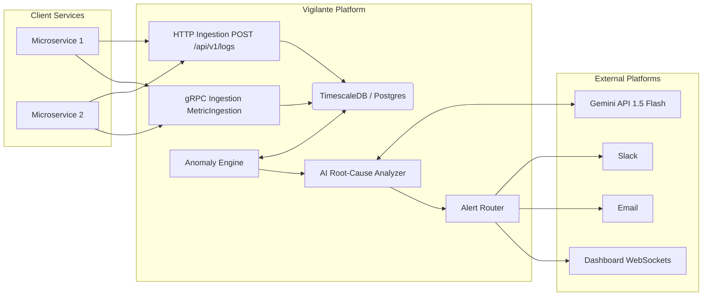

# Vigilante

Vigilante is a self-hostable Backend Observability & Incident Intelligence Platform written entirely in Go.

It ingests logs and metrics from multiple microservices via REST and gRPC, stores the time-series data efficiently via TimescaleDB, detects anomalies, and automatically queries the Gemini AI API for root-cause analysis.

## Architecture



## Quick Start

1. Start dependencies (Postgres + TimescaleDB):
   ```bash
   docker-compose up -d postgres
   ```
2. Set Environment Variables:
   ```bash
   cp .env.example .env
   # Edit .env with your Gemini API Key
   ```
3. Run Migrations:
   ```bash
   make migrate
   ```
4. Start Server:
   ```bash
   make run
   ```

## Environment Variables

| Variable | Description |
|---|---|
| `DATABASE_URL` | Postgres connection string |
| `JWT_SECRET` | Secret key for JWT auth token generation |
| `GEMINI_API_KEY` | Google AI API Key for anomaly analysis |
| `PORT` | HTTP Server Port (default 3000) |
| `GRPC_PORT` | gRPC Server Port (default 50051) |

## Screenshots

*Screenshots goes here once deployed!*
